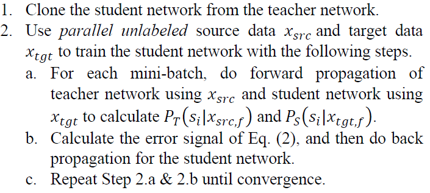

Edit in Mandarin.

看了這篇 2017 Microsoft AI and Research 的文章 "[Large-Scale Domain Adaptation via Teacher-Student Learning](https://www.researchgate.net/publication/319186662_Large-Scale_Domain_Adaptation_via_Teacher-Student_Learninghttps://www.researchgate.net/publication/319186662_Large-Scale_Domain_Adaptation_via_Teacher-Student_Learning)" 覺得滿有意思的，加上很容易實作，因此就分析一下這篇的可行性。

設計了一個 MNIST Toy Example 來展示 T/S Learning 的能力，自己也想知道這個方法有多可靠。

---
## TS Learning Methods

介紹一下 TS Learning 的方法。他要解決的問題描述如下

>假設我們已經有了一個訓練好的語音辨識模型，現在要辨識**遠場**的聲音，原 Domain (近場錄製的聲音)，可能效果就會不好。
>要解決最直接的方法就是重新錄製遠場語料，錄製的過程中很容易可以取得同時有近場和遠場未標記的語料 (放兩個麥克風，一個近一個遠)，不過關鍵是標記成本太高。因此這篇就是想利用**未標記的語料直接針對原 Domain 的模型 Adapt 到新的 Domain 上**。


以上面論文中的圖來說，左邊 Teacher network 只能在 Source Domain 有好的辨識能力，目標是希望得到右邊的 Student network 能在 Target Domain 針對同樣問題也有好的辨識能力。論文方法是一開始先將 Teacher network 拷貝一份給 Student network ，接著就開始餵 parallel data 給兩個 networks。

所謂 parallel data 意思是相同的資料來源，但是在不同 domain 蒐集，例如同一個人講同一句話，一個近場麥克風蒐集到，另一個遠場蒐集到。目標函式就是希望兩個 network 的後驗概率相同 (兩者的後驗概率平方誤差為0)，而我們只更新 Student network。在實作上不會使用後驗概率來計算兩個 network 的誤差，會使用未經過 softmax 的那層，也就是一般說的 logits 來計算。原因簡單說明如下:

> softmax 會將同樣是 negative 的類別的機率都壓到很低，但是 **negative examples 也有分好壞**，讀者可以試試 [10,2,1] 經過 softmax 後， 2 跟 1 之間的差異會被抹平。
> 因此好的做法是，不要使用 softmax ，而是使用 logits。 Hinton 在這篇[論文](https://arxiv.org/abs/1503.02531)裡修改了 softmax 函式，多了一個 temperature $T$，論文裡推導這樣修改的 softmax，其實跟目標函式使用 logits 的平方誤差是一樣的 (在每次input sample都具有mean=0的條件下)

這樣做的物理意義就相當於，**將 "某聲音的遠場表現在 Student network 眼裡"，視為跟 "該聲音的近場表現在 Teacher network 眼裡" 認定為相同一件事情。**因此就不需要針對 data 做標記了，只需要拿到這樣的一大堆 parallel data 就可以，而這很容易。

附上論文上的步驟如下:



演算法就這樣而已，很單純吧。但是究竟有多靠普? 好奇心下，就用 MNIST 設計了 toy example，就是接下來的內容囉。

---
## MNIST Toy Example for TS Learning

### 實驗設定 and Teacher Network

首先設定兩個 Domain 為: 一個原圖 (原世界)，另一個上下顛倒的圖 (上下顛倒的世界)。


Teacher network 是一個很簡單的 "6" 和 "9" 的辨識器，當然是在原世界訓練好的。如果直接拿 teacher network 去看顛倒的 6，期望它認出一樣是 6 是辨識不出來的! (同樣期望 teacher network 看出顛倒的 9 仍然是 9 也是辦不到的)

之所以會選 6 和 9，是因為就算上下顛倒，顛倒的 6 和正向的 9 看起來仍然是不同的! 同樣的，顛倒的 9 和正向的 6 一樣看起來不同 !


我們得到的 Teacher network 辨識情況如下:

```python
Training...

EPOCH 1 ...
Train Accuracy = 0.967; Flip Accuracy = 0.098

EPOCH 2 ...
Train Accuracy = 0.999; Flip Accuracy = 0.151

EPOCH 3 ...
Train Accuracy = 0.999; Flip Accuracy = 0.110
```

明顯看到辨識率接近 100%，但是一旦上下顛倒，辨識率只剩 10%。有意思的是，由於我們只有兩個類別，對於上下顛倒的辨識率剩10%可以看做: **顛倒的 6，會被認成 9，而顛倒的 9 會被認為 6**。但事實上，顛倒的 6 和 9 還是不一樣。

### Student network 訓練

我們將 MNIST 其他影像上下顛倒，做出 parallel dataset，然後按照論文的做法做 unsupervised training。有趣的是得到結果如下:

```python
EPOCH 1 ...
Acc loss = 3.871242271944786
Train Accuracy = 0.156; Flip Accuracy = 0.998

EPOCH 2 ...
Acc loss = 0.40557907682784994
Train Accuracy = 0.101; Flip Accuracy = 0.999

EPOCH 3 ...
Acc loss = 0.3005437100890939
Train Accuracy = 0.103; Flip Accuracy = 0.999

EPOCH 4 ...
Acc loss = 0.2651689475203995
Train Accuracy = 0.097; Flip Accuracy = 0.999

EPOCH 5 ...
Acc loss = 0.23342516055794454
Train Accuracy = 0.116; Flip Accuracy = 0.999
```

Student network 可以成功辨識 **顛倒的 6 和顛倒的 9 了!** 注意，我們從來沒有給過 Student network 顛倒的 6 和顛倒的 9 這些訓練資料! 但是現在它有能力辨識這兩種圖了!

但是同樣的，如果給 student network 看一個正向的 6，在他的眼哩，看起來就如同 teacher network 看到 9 一樣。

**也就是說，Student network 失去了原 Domain 的辨識能力。** 這與論文原作者的結論不大一樣。

### 用 parallel data 非監督學習到底學到了什麼?


給 T/S 網路看過很多很多的 parallel data 後，Teacher 眼裡的圖，在 Student 眼裡看起來就反過來，反之亦然。因此這時候如果給 Student network 看一個 "正向的6"，它會認為: 啊!這在 Teacher 眼裡看到的是一個顛倒的 6 。(而 teacher network 會將顛倒的 6 看做是 9)

因此我認為，Student netowrk 很容易失去原先 domain 的辨識能力，就像這個例子 student network 無法認出正向的 6 一樣。

---
## Summary

如何讓一個 network 同時有原 Domain 和新 Domain 的辨識能力呢 ? 以上面的 toy example 為例，就是辨識兩個 classes

* class 1: 6 and 顛倒的6
* class 2: 9 and 顛倒的9

最直覺的做法，就是 T and S models 都跑一次辨識，然後將兩個後驗概率加起來後算 argmax。缺點就是 model size 立馬變成兩倍。

怎麼讓模型 size 不要變成兩倍呢? 簡單想了一個方式，就是讓 student model 改成這樣的模型:


其中 M model 的部分負責將 上下顛倒的 domain 轉換成原 domain 的 input，然後這樣的 input 就可以原封不動地用 teacher model 去辨識。剛好這個問題其實用一個 permuation matrix 可以做上下顛倒，因此實驗上就直接使用一個 linear layer (沒有 activation function)，當然 backprob 算出來的不會正好是 permutation matrix 就是了。

收斂情況如下: 基本上比原先要慢，因為原來是所有的 weights 都可以調整，而現在只能動一個 linear layer

```python
EPOCH 1 ...
Acc loss = 9.52696829760659
Train Accuracy = 0.460; Flip Accuracy = 0.806

EPOCH 2 ...
Acc loss = 3.6580730849143146
Train Accuracy = 0.364; Flip Accuracy = 0.955

EPOCH 3 ...
Acc loss = 2.454553008463332
Train Accuracy = 0.304; Flip Accuracy = 0.980

EPOCH 4 ...
Acc loss = 1.823352760733923
Train Accuracy = 0.277; Flip Accuracy = 0.988

EPOCH 5 ...
Acc loss = 1.4707165408316494
Train Accuracy = 0.235; Flip Accuracy = 0.992
```

這樣做法雖然 model size 小了很多，但是要同時辨識正的和顛倒的仍然要跑兩遍的 model。

有沒有方法結合 TS learning unsupervised 的方式，且同時兼顧兩邊的 domain 辨識能力呢? 就再思考看看囉。

---
## Reference

1. [Large-Scale Domain Adaptation via Teacher-Student Learning](https://arxiv.org/abs/1708.05466)
2. [Distilling the Knowledge in a Neural Network](https://arxiv.org/abs/1503.02531)v
